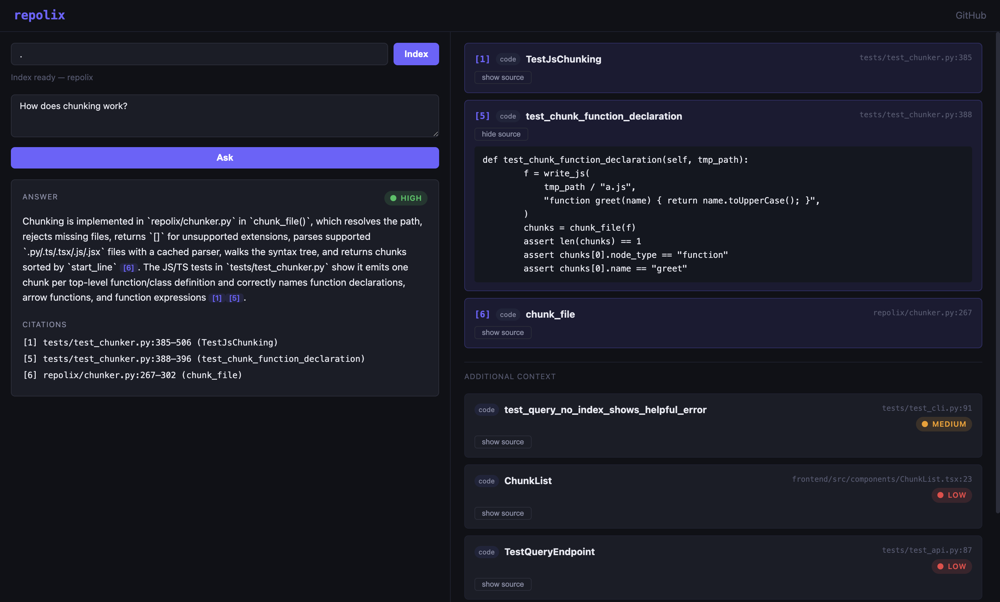

# repolix

[](https://pypi.org/project/repolix/)

**Ask plain English questions about any Python, JavaScript, or TypeScript codebase. Get answers with exact file and line citations. Runs entirely on your machine.**

## Preview



```
$ repolix index ./myrepo
Indexing /path/to/myrepo
Indexing  100% ████████████████████ 24/24
╭──────── Index Complete ─────────╮
│ Files found:    24              │
│ Files indexed:  22              │
│ Files skipped:  2 (unchanged)   │
│ Chunks stored:  183             │
╰─────────────────────────────────╯

$ repolix query "how does authentication work"
Searching...
Generating answer...
╭──────────────────────── Answer ──────────────────────────╮
│ authenticate_user() in auth/validators.py validates       │
│ credentials by calling validate_token() [1], which checks │
│ expiry and signature. On success it creates a session via │
│ SessionService.create() [2].                              │
╰───────────────────────────────────────────────────────────╯
──────────────────────── Citations ────────────────────────
  [1] auth/validators.py:14-28  (validate_token)
  [2] auth/session.py:45-67     (SessionService.create)

confidence: high
```

Your code never leaves your machine. No server. No accounts beyond an OpenAI API key.

---

## Quickstart

### Requirements

- Python 3.11+
- OpenAI API key ([get one here](https://platform.openai.com/api-keys))

> Node.js is **not required** for end users. The web UI is pre-built and bundled inside the package.

### Install

```bash
pip install repolix
```

### Set your API key

```bash
export OPENAI_API_KEY=sk-your-key-here
# or add it to a .env file in your working directory
```

### Index a repo

```bash
repolix index ./path/to/repo
```

### Ask a question

```bash
repolix query "how does authentication work"

# Raw chunks without LLM (useful for debugging retrieval)
repolix query "where is UserService defined" --no-llm

# Force re-index all files, not just changed ones
repolix index ./path/to/repo --force
```

### Get an orientation briefing

```bash
repolix tour .
```

```
╭──────────────────────────── Tour ─────────────────────────────╮
│ OVERVIEW                                                       │
│ repolix is a local-first codebase context engine...           │
│                                                                │
│ ENTRY POINTS                                                   │
│ repolix/cli.py — main() is the Click entrypoint               │
│ repolix/api.py — FastAPI app started by uvicorn               │
│                                                                │
│ MAJOR MODULES                                                  │
│ store.py: embedding pipeline and ChromaDB management          │
│ retriever.py: hybrid search, RRF, and re-ranking              │
│ ...                                                            │
╰────────────────────────────────────────────────────────────────╯
──────────────── Most Referenced ────────────────
  _get_client     called by 6 functions
  chunk_file      called by 4 functions

Analyzed 183 chunks
```

`repolix tour` scans the call-graph metadata already in ChromaDB — **no extra API calls for embeddings**. A single LLM call produces the briefing.

```bash
# Scope to a subdirectory
repolix tour . --path repolix/

# Save briefing to .repolix/tour.md
repolix tour . --save
```

### Trace a call graph

```bash
repolix trace retrieve
```

```
╭──────────────── Trace: retrieve ─────────────────╮
│ retrieve  [repolix/retriever.py:58]               │
│ ├── query_chunks  [repolix/store.py:180]          │
│ │   └── _get_client  [repolix/store.py:43]        │
│ ├── keyword_search  [repolix/store.py:240]        │
│ ├── reciprocal_rank_fusion  [repolix/retriever.py:...]│
│ └── expand_via_call_graph  [repolix/retriever.py:...]│
╰───────────────────────────────────────────────────╯
── Callers of retrieve ──────────────────────────────
  query          repolix/cli.py:181
  query_endpoint repolix/api.py:95

3 levels · 6 nodes
```

`repolix trace` is **zero API calls by default** — it reads call-graph metadata already stored in ChromaDB from the index run.

```bash
# Show what calls a function (reverse direction)
repolix trace retrieve --reverse

# Increase traversal depth
repolix trace index_repo --depth 5

# Add a plain-English explanation of the call chain (1 LLM call)
repolix trace retrieve --explain
```

### Web UI

```bash
uvicorn repolix.api:app --port 8000
# Open http://localhost:8000 (or whatever host/port you chose)
```

Use any port; the bundled UI talks to the API on the **same** origin. Add `--host 0.0.0.0` if you need LAN access. For **`npm run dev`** (frontend on :3000), the dev server defaults to an API at `http://localhost:8000`; set `VITE_API_URL` in `frontend/.env` if the API uses another host or port.

---

## Why repolix

Getting dropped into an unfamiliar codebase is painful. Documentation is outdated. Grep finds strings, not meaning. LLM chatbots hallucinate file names and function signatures because they have no access to your actual code.

---

## Who is this for

repolix is built for developers navigating codebases they didn't write —
onboarding to a new job, contributing to open source, or auditing vendor
code. It works on repos you don't own and don't have open in an editor.
Unlike IDE-integrated tools, it requires no active editing session and
nothing leaves your machine.

---

## How it works

**1. AST chunking**
Tree-sitter parses each file into a syntax tree (Python and JavaScript/TypeScript grammars). repolix splits only at function and class boundaries — every chunk is semantically complete. Methods are tracked with their parent class for disambiguation.

**2. Hybrid search**
Queries run against OpenAI embeddings (vector search) and exact token matching (keyword search) simultaneously. Results are merged using Reciprocal Rank Fusion, a ranking algorithm that rewards consistency across search methods over dominance in just one.

**3. Call graph expansion**
After initial retrieval, repolix inspects each chunk's call graph and fetches called functions that didn't rank highly on their own. This surfaces implementation details that live one function call away from the entry point.

**4. Metadata re-ranking**
Retrieved chunks are re-ranked using function names, file paths, docstrings, and call graph signals before being sent to the LLM.

**5. Cited answers**
The top chunks go to the LLM with instructions to answer directly and cite every claim. Citations map back to exact file paths and line numbers.

---

## Output format

Each query produces:

- A prose answer with inline citations `[1]`, `[2]`, etc.
- A citations section with exact file paths and line ranges. Citations marked `[truncated]` mean the function exceeded the 300-token chunk cap.
- A confidence label (`high` / `medium` / `low`) based on how strongly the retrieved chunks matched the query across function names, file paths, docstrings, and call graph signals.

---

## Cost

| Action | Approximate cost |
|---|---|
| Index a 30k-line repo | ~$0.02 (one-time) |
| Re-index after a small change | ~$0.001 (changed files only) |
| Each query | ~$0.001 |

Incremental indexing means only changed files are re-embedded on subsequent runs.

---

## Stack

| Layer | Choice |
|---|---|
| AST parsing | Tree-sitter |
| Embeddings | text-embedding-3-small |
| Vector store | ChromaDB (local, no server needed) |
| LLM | gpt-5.4-mini |
| Backend | FastAPI |
| Frontend | React + TypeScript |
| CLI | Click + Rich |

---

## Install from source

```bash
git clone https://github.com/TheAsianFish/repolix
cd repolix
python -m venv .venv
source .venv/bin/activate
pip install -e ".[dev]"
```

**For frontend development** (requires Node.js 18+):

```bash
cd frontend && npm install && cd ..
bash start.sh
# Backend: http://localhost:8000  |  Frontend: http://localhost:3000
```

---

## Limitations

- JSDoc is not extracted into chunk text yet (JavaScript/TypeScript chunks use source and identifiers only)
- Best on repos up to ~30k lines
- Deeply nested functions are included in their parent chunk
- Large functions (>300 tokens) are truncated at the chunk cap
- Complex cross-file reasoning may require rephrasing the query

---

## Roadmap

**Shipped in V2**
- `.ts`, `.tsx`, `.js`, `.jsx` indexing via Tree-sitter JavaScript/TypeScript grammars
- `repolix tour` — proactive orientation briefing driven by call-graph metadata (0.2.2)
- `repolix trace` — BFS call-graph traversal with forward/reverse/explain modes (0.2.3)

**Next in V2**
- Local model support via Ollama (zero API cost, fully air-gapped)
- Persistent query sessions across terminal restarts

**Considering for V3**
- VS Code extension
- Multi-repo support

---

## Contributing

Bug reports and pull requests are welcome. Please open an issue before submitting a large change so we can discuss the approach.

---

## License

MIT © 2026 Patrick Chung
